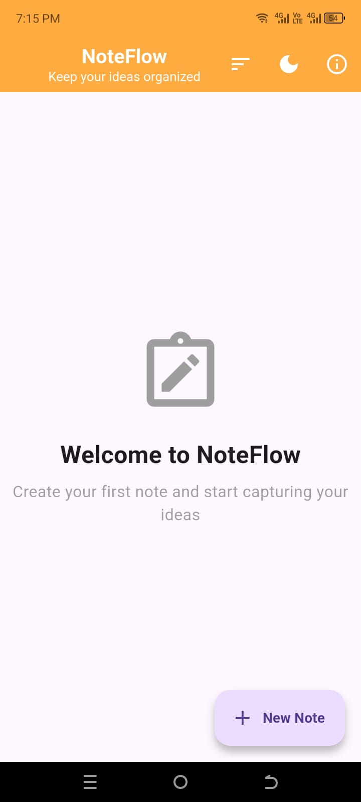
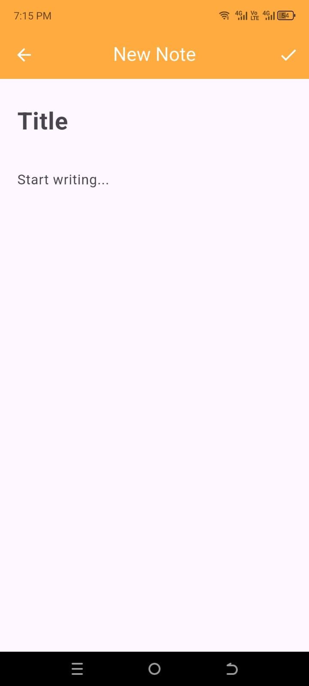
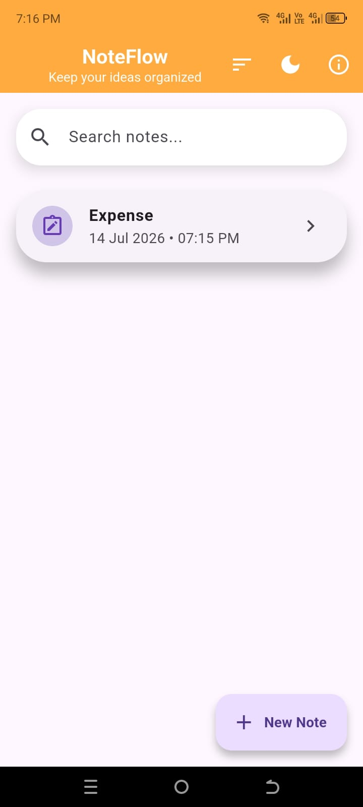
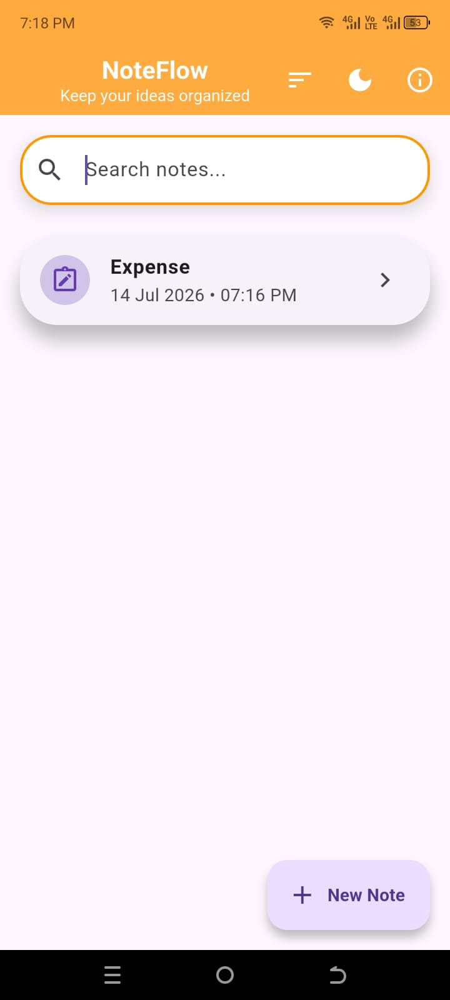
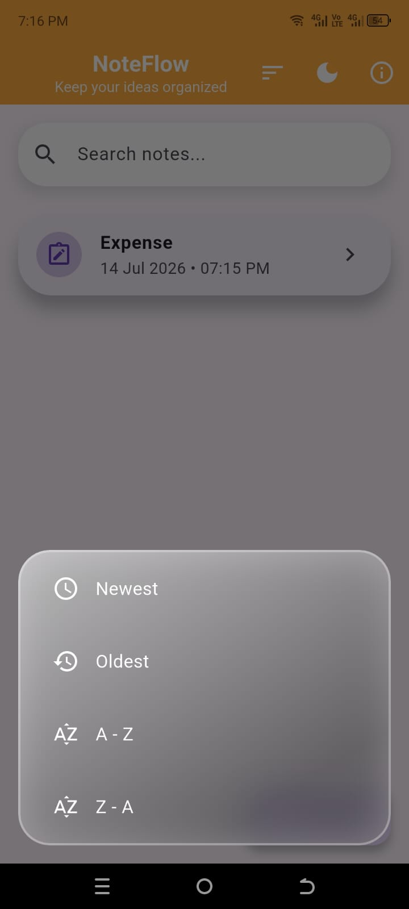
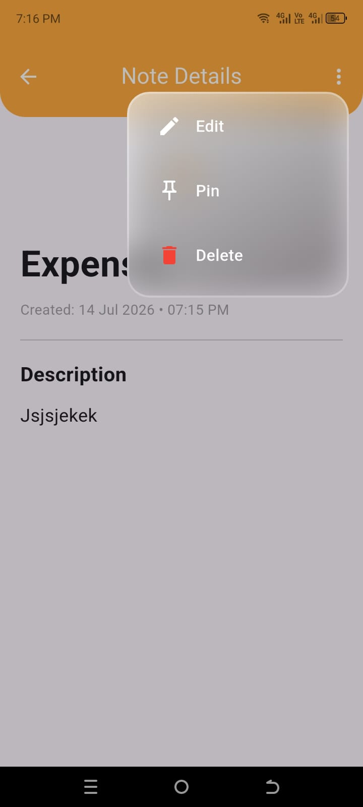
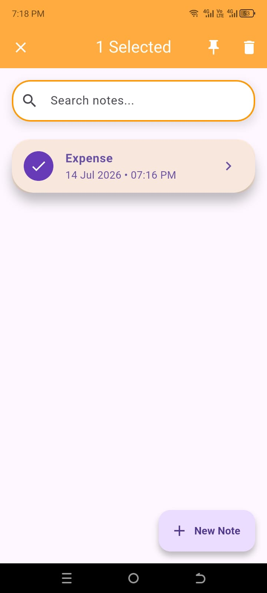
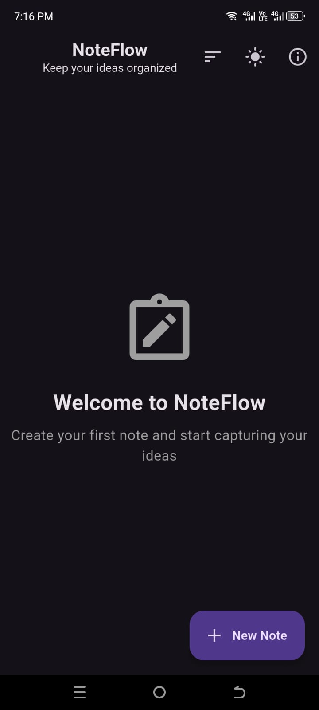

# 📒 NoteFlow

A modern and intuitive note-taking application built with **Flutter**. NoteFlow provides a clean user interface, offline storage, note organization, search functionality, dark mode, and a smooth user experience for managing daily notes.

---

## ✨ Features

- 📝 Create, edit and delete notes
- 📌 Pin important notes
- 🔍 Search notes instantly
- 📂 Sort notes
- 🌙 Light & Dark Mode
- 💾 Offline storage using Hive
- 🎨 Modern Material Design UI
- ⚡ Fast and responsive performance

---

## 📸 Screenshots

<p align="center">
  
  
  
</p>

<p align="center">
  
  
  
</p>

<p align="center">
  
  
  
</p>

## 🛠 Tech Stack

* Flutter
* Dart
* Hive Database
* Material 3
* Intl Package

## 🚀 Getting Started

Clone the repository

```bash
git clone https://github.com/zainwaqasDev/NoteFlow.git
```

Go into the project

```bash
cd NoteFlow
```

Install dependencies

```bash
flutter pub get
```

Run the application

```bash
flutter run
```

---


## 👨‍💻 Developer

**Zain Waqas**

Flutter Developer

GitHub:
https://github.com/zainwaqasDev

---

⭐ If you like this project, consider giving it a star.